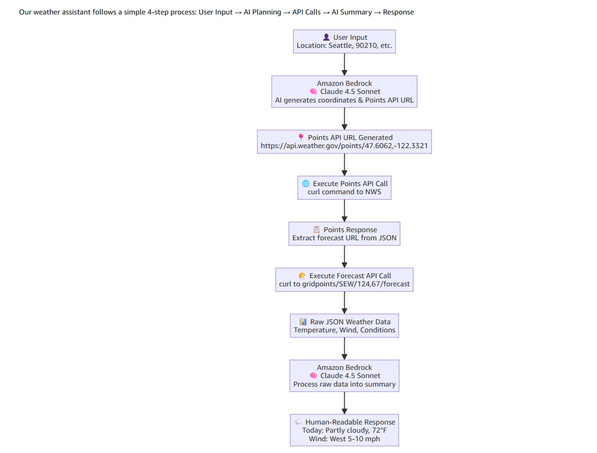

# 🌤️ Build Your First AI Agent with Python & AWS 

> No AI/ML experience needed. Just Python basics, an AWS account, and curiosity.

This guide walks you through building a **real, working Agentic AI system** from scratch — a weather assistant that thinks, plans, and takes action using Claude 4.5 Sonnet on Amazon Bedrock and the National Weather Service API.

---

## 📋 Table of Contents

- [What You'll Build](#-what-youll-build)
- [What is Agentic AI?](#-what-is-agentic-ai)
- [Environment Setup](#-environment-setup)
- [Understanding the Architecture](#-understanding-the-architecture)
- [Building the CLI Agent](#-building-the-cli-agent)
- [Running the Web Interface](#-running-the-web-interface)
- [Key Takeaways & Next Steps](#-key-takeaways--next-steps)

---

## 🚀 What You'll Build

A Python-based AI agent that:

| Capability | How |
|---|---|
| 🧠 **Thinks** | Interfaces with Claude 4.5 Sonnet via Amazon Bedrock |
| ⚡ **Acts** | Makes live HTTP requests to the National Weather Service API |
| 🔄 **Processes** | Handles JSON data with standard Python |
| 💬 **Responds** | Delivers results via CLI or a Streamlit web interface |

**Workshop Agenda at a Glance:**
1. What is Agentic AI? — Core concepts, no buzzwords
2. Environment Setup — Python and AWS SDK
3. Architecture Overview — How the pieces connect
4. Build from Scratch — Step-by-step coding
5. Web Interface — Streamlit application
6. Key Takeaways — Foundation for what comes next

**Prerequisites:**
- ✅ Basic Python (variables, functions, conditionals)
- ✅ An AWS account (or a provided workshop environment)
- ✅ No prior AI/ML experience required

---

## 🤖 What is Agentic AI?

### Traditional AI: Question → Answer

Traditional AI systems act like very smart encyclopedias — they respond based on static training data.

```
User: "What is the weather like in New York?"
AI:   "Sorry, I can't provide live weather data. Weather refers to 
       atmospheric conditions including temperature, humidity..."
```

**Limitation:** Static, no real-world actions, no live data.

### Agentic AI: Problem → Plan → Action → Result

Agentic systems *think, plan, and act* to solve problems:

```
User: "What's the weather forecast for New York this weekend?"

Agent:
  1. THINKS   → "I need current data for New York's coordinates"
  2. PLANS    → "Call the NWS Points API first, then the Forecast API"
  3. ACTS     → Executes the API calls
  4. PROCESSES→ Parses the JSON forecast data
  5. RESPONDS → "Saturday: sunny, 75°F. Sunday: partly cloudy, 20% rain chance."
```

### The Three Characteristics of an Agentic System

| Trait | Description |
|---|---|
| 🤖 **Autonomy** | Makes decisions without constant human guidance; chooses the right tools |
| ⚡ **Reactivity** | Responds to errors and unexpected inputs; adjusts its strategy |
| 🎯 **Proactivity** | Plans multi-step processes and anticipates what's needed |

### Why Amazon Bedrock?

Amazon Bedrock provides a managed, secure foundation for agentic AI — no servers, built-in compliance, access to multiple models (Claude, Nova, Llama), and seamless AWS integration. Claude 4.5 Sonnet specifically excels at complex reasoning, structured data processing, and natural language generation.

---

## ⚙️ Environment Setup

### What You'll Need

- Python 3.7+
- AWS CLI configured with valid credentials
- Claude 4.5 Sonnet enabled in Amazon Bedrock (us-west-2 region)

### Step-by-Step Setup

**1. Install Python** (if not already): [python.org/downloads](https://python.org/downloads)

**2. Configure AWS credentials:**

```bash
aws configure
# Enter: Access Key, Secret Key, region (us-west-2), output format (json)
```

**3. Create and activate your project environment:**

```bash
mkdir agentic-ai-workshop && cd agentic-ai-workshop
python -m venv .venv
source .venv/bin/activate        # macOS/Linux
# .venv\Scripts\activate         # Windows
```

**4. Install dependencies:**

```bash
pip install boto3>=1.34.0 streamlit>=1.28.0 requests>=2.31.0 Pillow>=10.0.0
```

**5. Enable Claude 4.5 Sonnet** in the [Amazon Bedrock console](https://console.aws.amazon.com/bedrock/) under Model Access.

**6. Verify your setup:**

```bash
aws sts get-caller-identity
python -c "import boto3, streamlit, requests; print('✅ All packages installed')"
```

### Required IAM Permissions

```json
{
  "Version": "2012-10-17",
  "Statement": [{
    "Effect": "Allow",
    "Action": [
      "bedrock:InvokeModel",
      "bedrock:Converse",
      "bedrock:ListFoundationModels",
      "bedrock:GetFoundationModel"
    ],
    "Resource": "*"
  }]
}
```

> **Troubleshooting tip:** If you get "Model access denied", ensure you've enabled Claude 4.5 Sonnet in the Bedrock console and that your IAM user has the permissions above.

---

## 🏗️ Understanding the Architecture

### How the NWS API Works (Two-Step Process)

The National Weather Service exposes free weather data through a two-step API:

```
Step 1 — Points API
  Input:  Latitude/Longitude
  URL:    https://api.weather.gov/points/{lat},{lon}
  Output: The forecast office + grid coordinates for that location

Step 2 — Forecast API
  Input:  Office + grid from Step 1
  URL:    https://api.weather.gov/gridpoints/{office}/{gridX},{gridY}/forecast
  Output: Detailed weather forecast data (JSON)
```

Example for Seattle: `(47.6062, -122.3321)` → SEW office, grid 124,67 → full 7-day forecast.

### The Agent's Workflow



The diagram above shows how each step flows end-to-end. Here's what's happening at each stage:

| Step | Node | What Happens |
|---|---|---|
| 1️⃣ | **User Input** | User provides a location — city name, ZIP code, coordinates, or a natural description like *"national park near Homestead in Florida"* |
| 2️⃣ | **Amazon Bedrock (Claude 4.5 Sonnet)** | AI reasons about the location, determines the correct lat/lon coordinates, and generates the NWS Points API URL |
| 3️⃣ | **Points API URL Generated** | A precise URL like `https://api.weather.gov/points/47.6062,-122.3321` is produced |
| 4️⃣ | **Execute Points API Call** | Agent fires a `curl` request to NWS — fetching which forecast office and grid square covers that location |
| 5️⃣ | **Points Response** | The JSON response is parsed to extract the correct Forecast API URL |
| 6️⃣ | **Execute Forecast API Call** | Agent calls `gridpoints/SEW/124,67/forecast` to retrieve the actual weather data |
| 7️⃣ | **Raw JSON Weather Data** | Temperature, wind speed, conditions, and more are returned in structured JSON |
| 8️⃣ | **Amazon Bedrock (Claude 4.5 Sonnet)** | AI processes the raw JSON and writes a clean, context-aware summary |
| 9️⃣ | **Human-Readable Response** | User receives a clear forecast: *"Today: Partly cloudy, 72°F. Wind: West 5-10 mph."* |

### Traditional vs. Agentic Approach

```python
# Traditional: Brittle, hardcoded
if location == "Seattle":
    api_url = "https://api.weather.gov/gridpoints/SEW/124,67/forecast"

# Agentic: AI reasons and adapts dynamically
ai_prompt = f"Generate NWS API calls for: {location}"
api_url = claude_4_sonnet(ai_prompt)
```

---

## 🔨 Building the CLI Agent

Create a file called `weather_agent_cli.py` in your project directory and build it out in three steps.

### Step 1 — Connect to Claude via Amazon Bedrock

```python
import boto3
import json
import subprocess

def call_claude_sonnet(prompt):
    """Send a prompt to Claude 4.5 Sonnet and return the response."""
    bedrock = boto3.client(
        service_name='bedrock-runtime',
        region_name='us-west-2'
    )
    try:
        response = bedrock.converse(
            modelId='us.anthropic.claude-sonnet-4-5-20250929-v1:0',
            messages=[{"role": "user", "content": [{"text": prompt}]}],
            inferenceConfig={"maxTokens": 2000, "temperature": 0.7}
        )
        return True, response['output']['message']['content'][0]['text']
    except Exception as e:
        return False, f"Error calling Claude: {str(e)}"
```

Test it by running `python weather_agent_cli.py` — you should see Claude's response confirming the connection.

### Step 2 — Add Agent Logic

Three core functions power the agent:

- **`execute_curl_command(url)`** — The agent's "hands": makes HTTP requests to the NWS APIs
- **`generate_weather_api_calls(location)`** — The "planning brain": prompts Claude to figure out the correct NWS Points API URL from any location input
- **`process_weather_response(raw_json, location)`** — The "analysis brain": prompts Claude to convert complex JSON into a readable forecast

The planning prompt is key — it teaches Claude about NWS coordinate systems and handles ambiguous inputs:

```python
prompt = f"""
You are an expert at working with the National Weather Service (NWS) API.
Generate the NWS Points API URL for: "{location}"

Determine the approximate lat/lon and return ONLY the URL.
Format: https://api.weather.gov/points/LAT,LON

Examples:
- Seattle → https://api.weather.gov/points/47.6062,-122.3321
- Largest city in USA → https://api.weather.gov/points/40.7128,-74.0060
"""
```

### Step 3 — The Main Agent Workflow

```python
def run_weather_agent():
    while True:
        location = input("🔍 Enter a location (or 'quit'): ").strip()
        if location.lower() in ['quit', 'exit']: break

        # Step 1: AI generates Points API URL
        success, api_calls = generate_weather_api_calls(location)

        # Step 2: Call Points API
        success, points_response = execute_curl_command(api_calls[0])

        # Step 3: Extract Forecast URL from Points response
        success, forecast_url = get_forecast_url_from_points_response(points_response)

        # Step 4: Call Forecast API
        success, forecast_response = execute_curl_command(forecast_url)

        # Step 5: AI processes and summarizes
        success, summary = process_weather_response(forecast_response, location)

        print(summary)
```

**Test it with these inputs:**
- `"Seattle"` — Major city
- `"90210"` — ZIP code
- `"National park near Homestead in Florida"` — Natural language description
- `"Largest city in California"` — AI knowledge-based reasoning

---

## 🌐 Running the Web Interface

The same agent logic powers a Streamlit web app. Create `weather_agent_web.py` and run:

```bash
streamlit run weather_agent_web.py
# Open http://localhost:8501
```

The web app visualizes each phase of the agentic workflow with real-time status indicators and expandable raw API responses for inspection.

### CLI vs. Web — Which to Use?

| Feature | CLI (`weather_agent_cli.py`) | Web (`weather_agent_web.py`) |
|---|---|---|
| Audience | Developers | Non-technical users |
| Best for | Automation, scripting | Demos, presentations |
| Experience | Raw, step-by-step | Visual, interactive |

Both versions use **identical AI logic** — same Claude model, same NWS integration, same pipeline.

---

## 🎯 Key Takeaways & Next Steps

### What Makes This "Agentic"?

Your weather assistant demonstrates all three agentic characteristics:

| Trait | In Action |
|---|---|
| 🤖 **Autonomy** | Interprets any location format, constructs API URLs, recovers from errors — without human guidance |
| ⚡ **Reactivity** | Adapts to city names, ZIP codes, coordinates, or descriptive text; handles network issues gracefully |
| 🎯 **Proactivity** | Plans the two-API sequence from minimal input; identifies the most relevant forecast insights |

### Core Patterns to Carry Forward

```
Input → AI Coordinate Generation → Points API → Forecast API → AI Processing → Response
```

This pattern scales to countless domains:

- **Travel planning** — Location → Weather + Flights → Recommend
- **Emergency response** — Alert → Location → Gather Data → Coordinate
- **Agriculture** — Farm → Monitor conditions → Advise

### Extend This Project

**In the next few hours:**
- Add international weather APIs or air quality data
- Implement retry logic and better error messages
- Add conversation memory to remember past queries

**Over the next few weeks:**
- Build multi-agent systems (weather + travel + events working together)
- Add database storage and notification integrations
- Enhance the UI with maps and charts

**Production readiness:**
- Deploy with AWS Lambda, ECS, or EKS
- Add IAM-scoped security, KMS encryption, and audit logging via CloudTrail
- Implement caching and parallel API calls for performance

### Five Principles to Remember

1. **Start simple, iterate quickly** — Your agent grew from a single API call to a full workflow. Apply this approach to every AI project.
2. **AI as a reasoning engine** — Use Claude for decision-making and planning, not just text generation.
3. **Human-AI collaboration** — The best agents augment human capabilities; they don't replace them.
4. **Error handling is non-negotiable** — Real-world systems fail. Graceful error recovery is what makes agents reliable.
5. **UX matters** — The same logic can serve different audiences through different interfaces (CLI vs. web).

---

## 📚 Resources

| Resource | Link |
|---|---|
| Amazon Bedrock Docs | [docs.aws.amazon.com/bedrock](https://docs.aws.amazon.com/bedrock/) |
| AWS SDK for Python (boto3) | [boto3.amazonaws.com](https://boto3.amazonaws.com/v1/documentation/api/latest/index.html) |
| Streamlit Docs | [docs.streamlit.io](https://docs.streamlit.io) |
| NWS API | [api.weather.gov](https://api.weather.gov) |
| Anthropic Prompt Engineering Guide | [docs.anthropic.com](https://docs.anthropic.com/en/docs/build-with-claude/prompt-engineering/overview) |
| AWS Agentic Workshop | [catalog.workshops.aws/building-agentic-workflows](https://catalog.workshops.aws/building-agentic-workflows/en-US) |

---

## 🤝 Contributing

Contributions are welcome! Open an issue or submit a pull request.

## 📄 License

MIT-0 License — see [LICENSE](./LICENSE) for details.

---

> *You now have the foundational knowledge to build the next generation of intelligent, action-taking applications. What's your next agent?* 🚀
